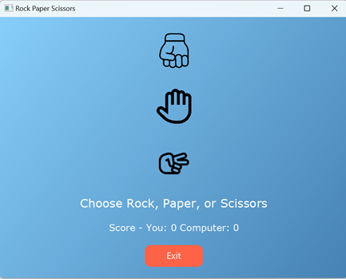

# Rock Paper Scissors Game

A simple **Rock Paper Scissors** game built in Java.

## Features
- Play against the computer
- Score tracking
- Best of 3 rounds
- Choose between **Console Mode** and **UI Mode** to play the game

## How to Run
1. Clone repository: `git clone <repo link>`
2. Navigate to the project: `cd rock_paper_scissors_app`
3. Compile the project: `javac -d out -sourcepath src src/app/Main.java`
4. Run the game:
    - To run in **Console Mode**, run the `Main` function in `ConsoleView` by using:  
      `java -cp out view.ConsoleView`
    - To run in **UI Mode**, run the `Main` function in `GameUI` by using:  
      `java -cp out view.GameUI`
    - Or run the `Main` class in `app.Main` to choose between **Console Mode** or **UI Mode** when prompted.

## Image Sources
<a href="https://www.flaticon.com/free-icons/fist" title="fist icons">Fist icons created by Cuputo - Flaticon</a>  
<a href="https://www.flaticon.com/free-icons/rock-paper-scissors" title="rock paper scissors icons">Rock paper scissors icons created by Cap Cool - Flaticon</a>  
<a href="https://www.flaticon.com/free-icons/rock-paper-scissors" title="rock paper scissors icons">Rock paper scissors icons created by iconading - Flaticon</a>  

## Game Layout
